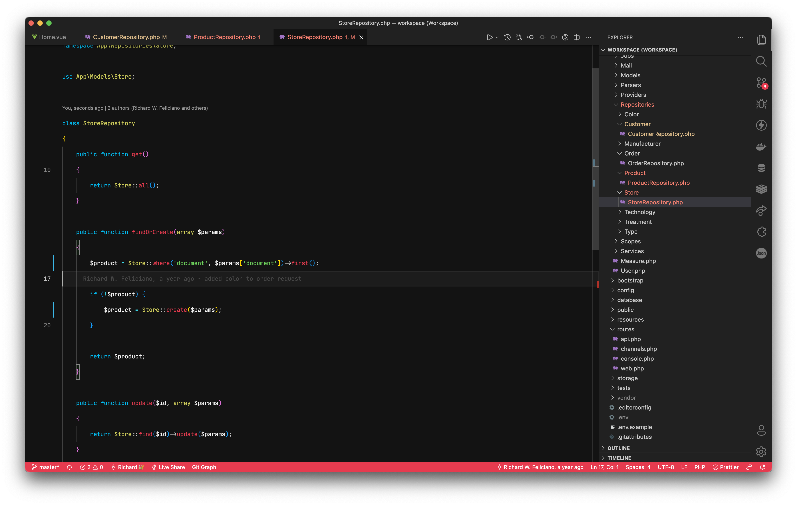
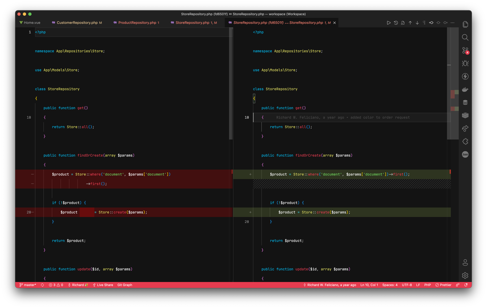
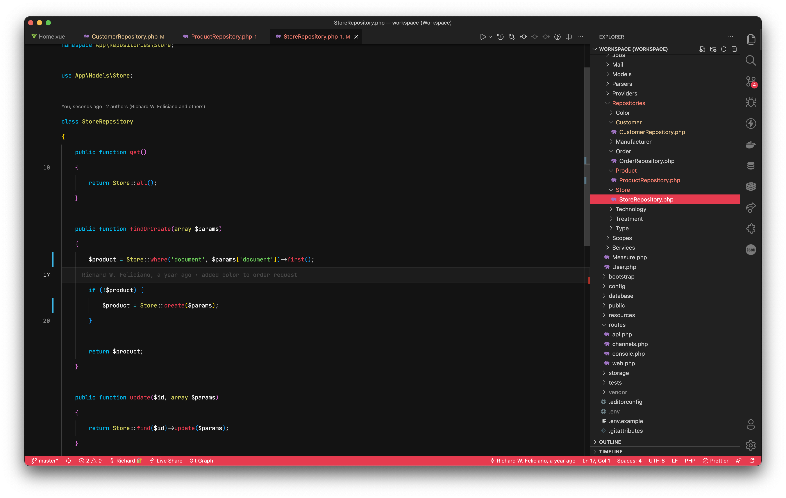

> Source from: https://github.com/richardfeliciano/themello
> Feel free to download if you are a DEVELLO, or download if you're like it.

## Install

```shell
ext install ayu
```

Then go to `Preferences > Color Theme > Themello)`.

## Screenshots

#### Themello



